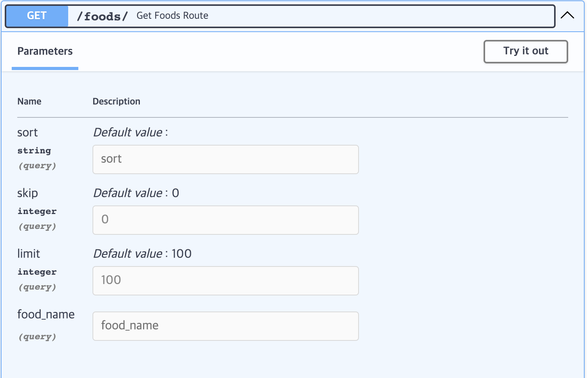

# FastAPI-Project

## API 설명
* GET /foods/

    모든 음식을 READ합니다.
***
* GET /food/{food_id}

    ID가 food_id인 음식 한 개를 READ합니다.
***
* POST /food/create

    body를 통해 음식 데이터를 CREATE합니다.
***
* POST /food/{food_id}/update

    ID가 food_id인 음식 한 개를 UPDATE합니다.
***
* POST /food/{food_id}/delete

    ID가 food_id인 음식 한 개를 DELETE합니다.
***
* GET /categories/

    모든 음식 종류를 READ합니다.
***
* GET /category/{category_id}

    ID가 category_id인 음식 종류 한 개를 READ합니다.
***
* GET /category/{category_id}/foods

    ID가 category_id인 종류의 음식들을 READ합니다.
***
* POST /category/create

    body를 통해 음식 종류를 CREATE합니다.
***
* POST /category/{category_id}/update

    ID가 category_id인 음식 종류 한 개를 UPDATE합니다.
***
* POST /category/{category_id}/delete

    ID가 category_id인 음식 종류 한 개를 DELETE합니다.
***
* GET /brands/

    모든 음식 브랜드를 READ합니다.
***
* GET /brand/{brand_id}

    ID가 brand_id인 음식 브랜드 한 개를 READ합니다.
***
* GET /brand/{brand_id}/foods

    ID가 brand_id인 브랜드의 음식들을 READ합니다.
***
* POST /brand/create

    body를 통해 음식 브랜드를 CREATE합니다.
***
* POST /brand/{brand_id}/update

    ID가 brand_id인 음식 브랜드 한 개를 UPDATE합니다.
***
* POST /brand/{brand_id}/delete

    ID가 brand_id인 음식 브랜드 한 개를 DELETE합니다.
***
**GET 메소드를 제외한 모든 POST 메소드 API는 JWT로 보안되어있습니다**

## GET /foods/, /category/{category_id}/foods, /brand/{brand_id}/foods에 대하여
1. 코드
```python
def get_sorted_data(
    db: Session,
    skip: int,
    limit: int,
    sort_criteria: SortCriteria,
    food_name: Optional[str] = None,
):
    query = db.query(Food)

    if food_name:
        query = query.filter(text("MATCH (name) AGAINST (:food_name)")).params(
            food_name=food_name
        )

    for sort_item in sort_criteria.sort:
        column = getattr(Food, sort_item.column, None)
        if column:
            if sort_item.order == "desc":
                query = query.order_by(column.desc())
            else:
                query = query.order_by(column)

    items = query.offset(skip).limit(limit).all()
    total = query.count()

    return items, total
```


* DB에 저장되어 있는 식품들의 이름에 대해 **FULLTEXT index**를 추가합니다.
* sort란에 정렬하고자 하는 칼럼과 정령방식을 입력합니다.

    ex) "{"column":"protein","order":"desc"},{"column":"fat","order":"asc"}" 입력시 1순위 단백질을 기준 내림차순으로 정렬되고 단백질 함량이 같은 경우 2순위인 지방 기준 오른차순으로 정렬됩니다.
* food_name란에 찾고자 하는 음식의 이름을 입력합니다.

    ex) 닭가슴살 입력시 -> 스리라차마요닭가슴살, 허니소이닭가슴살 등 닭가슴살이 들어간 음식들이 반환됩니다.